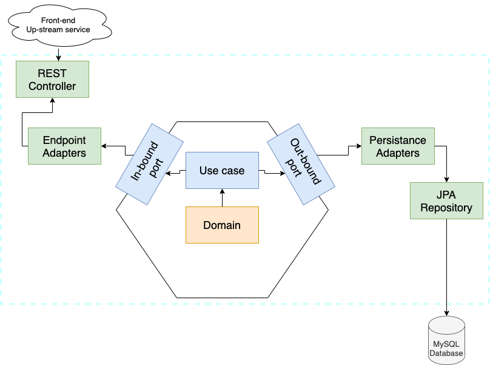

# Prueba-praxis
## 📋 Índice

- [Resumen del Proyecto](#-resumen-del-proyecto)
- [Demo](#-demo)
- [Arquitectura](#️-arquitectura)
- [Dependencias Principales](#️-dependencias-principales)
- [Configuración y Ejecución](#-configuración-y-ejecución)
- [Testing](#-testing)
- [Internacionalización](#-internacionalización)
- [Registro (Logging)](#-registro-logging)

## 📝 Resumen del Proyecto
Este proyecto expone mi interpretación de la arquitectura hexagonal, utilizando el framework Spring Boot.

El diagrama de la arquitectura hexagonal se basa en lo siguiente:

He intentado tomar un diagrama que he visto comúnmente en diferentes artículos, aunque observé que los términos "puerto/adaptador" se pueden intercambiar.

Esta arquitectura sigue la arquitectura limpia de Uncle Bob:

[https://blog.cleancoder.com/uncle-bob/2012/08/13/the-clean-architecture.html](https://blog.cleancoder.com/uncle-bob/2012/08/13/the-clean-architecture.html)

This project is following this diagram on spring-boot framework.

Este proyecto sigue este diagrama utilizando el framework Spring Boot.

## Diagramas de la aplicación
En este caso, el diagrama de enfoque es el siguiente:

En el que tenemos como parte de la aplicación:

Implementación REST
Conexión a base de datos
Los colores tienen los siguientes significados:

Naranja: este es el modelo de dominio de nuestra aplicación, que se encuentra en com.example.service.user.domain
Azul: esta es la aplicación en sí, donde tenemos la lógica y los puertos (para aplicar esta lógica de y hacia). El paquete es: com.example.service.user.application
Verde: este es el paquete com.example.service.user.adapter, donde están las implementaciones de los puertos. Se decidió mantener los repositorios y los controladores, aunque esto podría haberse movido al paquete infrastructure.
Lo que no se mostró en este diagrama fue el paquete:

com.example.service.user.infrastructure

Este paquete es transversal, por lo que no tiene un flujo específico en el diagrama, pero impacta en la definición de componentes compartidos.:

`com.example.service.user.infrastructure`

La aplicación se ejecutará en `http://localhost:8080`.
## Pruebas de Carga
Para realizar pruebas de carga en este proyecto, se han incluido tres archivos de configuración de JMeter en la raíz del repositorio. Estos archivos corresponden a distintas solicitudes y casos de uso de la API. Puedes importarlos a JMeter y ejecutarlos directamente para simular el tráfico y analizar el rendimiento de la aplicación.

### Pasos para Ejecutar las Pruebas de Carga

-**Abrir JMeter**: Asegúrate de tener JMeter instalado y ejecutándolo en tu máquina.

-**Importar Archivos de Prueba**:  En la raíz del repositorio de Git, encontrarás tres archivos con la extensión .jmx. Importa cada uno en JMeter desde File > Open.

-**Ejecutar las Pruebas**: Cada archivo simula una solicitud diferente de la API y está preconfigurado con los datos necesarios. Puedes modificar los parámetros de los hilos o el tiempo de espera para adaptarlos a tus necesidades.

## Arquitectura Propuesta

### Componentes de la Arquitectura
API Gateway (🚪): Actúa como el punto de entrada para todas las solicitudes a la API. Permite la gestión de rutas, autenticación y autorización, y escalabilidad automática.

### AWS Lambda Functions:

**Auth Function (🛡️)**: Se encarga de autenticar a los usuarios que acceden a la API, asegurando que solo los empleados autorizados puedan registrar su entrada y salida.

**Register Entry/Exit Function (📝)**: Permite registrar el ingreso y salida de los empleados. Esta función se invoca cuando un empleado interactúa con la API para registrar su tiempo.

**Employee Management Function (👥)**: Proporciona funcionalidades para gestionar la información de los empleados, como la creación, actualización y eliminación de registros.

**Base de Datos (📊)**:
**DynamoDB o RDS**: Almacena la información de los empleados y los registros de entradas y salidas. DynamoDB ofrece una solución NoSQL escalable, mientras que RDS proporciona una base de datos relacional tradicional.

**Almacenamiento en S3 (📂)**: Utilizado para almacenar archivos y datos estáticos relacionados con los empleados, como documentos de identificación o certificados.

**Monitoreo con CloudWatch (🔍)**: Permite la supervisión de la API, registrando métricas y eventos que ayudan a identificar problemas de rendimiento y optimizar la infraestructura.

## Justificación De La Arquitectura Propuesta

### Beneficios de la Solución

**Automatización**: Al eliminar el proceso manual de registro en hojas de cálculo, se reduce la posibilidad de errores humanos y se optimizan los tiempos de registro.

**Integración de Datos**: La API facilita la integración con otros sistemas y procesos en la organización, permitiendo un flujo de información más eficiente.

**Escalabilidad**: Con el uso de AWS Lambda y API Gateway, la arquitectura puede escalar automáticamente según la demanda, garantizando un rendimiento óptimo incluso durante picos de actividad.

**Seguridad**: La implementación de funciones de autenticación asegura que solo los empleados autorizados tengan acceso a la API y a la información sensible.

**Monitoreo Proactivo**: Con CloudWatch, se pueden identificar y resolver problemas de rendimiento antes de que afecten a los usuarios, garantizando la disponibilidad del sistema.

## Contribuciones

Las contribuciones son bienvenidas. Por favor, envía un pull request o abre un issue para discutir cambios.

## Licencia

Este proyecto está bajo la Licencia MIT. Consulta el archivo `LICENSE` para más detalles.
